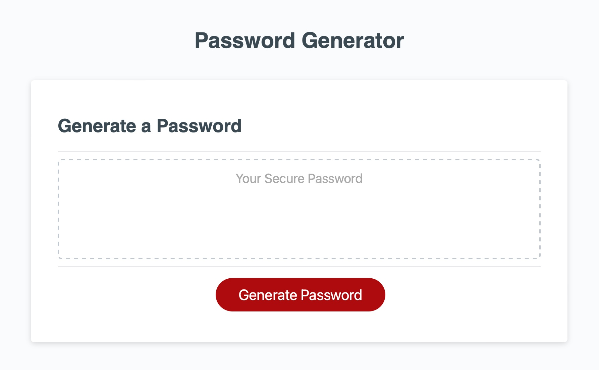

# Random Password Generator Page

## Description

This website will allow the user to create a unique password made up of between 8 to 128 characters, including lowercase letters, uppercase letters, numbers, and special characters. If the user chooses a password shorter than 8 characters or longer than 129, the confirm question will repeat.

This project was undertaken to give the user the ability to quickly create a unique password for their various online logins. The goal of this project was to assist the user's ability to increase their personal online security by making it fast and easy to create a unique password.

## Installation

The website is deployed to github pages and no special steps are required to view the website or get the decelopment environment runnign,

## Technologies

The site was developed using: HTML, CSS, and Javascript.

## Usage

You can find the page deployed [here](https://prgottinger.github.io/random-password-generator/).

## License

MIT License

Copyright (c) [2021] [PR Gottinger]

Permission is hereby granted, free of charge, to any person obtaining a copy
of this software and associated documentation files (the "Software"), to deal
in the Software without restriction, including without limitation the rights
to use, copy, modify, merge, publish, distribute, sublicense, and/or sell
copies of the Software, and to permit persons to whom the Software is
furnished to do so, subject to the following conditions:

The above copyright notice and this permission notice shall be included in all
copies or substantial portions of the Software.

THE SOFTWARE IS PROVIDED "AS IS", WITHOUT WARRANTY OF ANY KIND, EXPRESS OR
IMPLIED, INCLUDING BUT NOT LIMITED TO THE WARRANTIES OF MERCHANTABILITY,
FITNESS FOR A PARTICULAR PURPOSE AND NONINFRINGEMENT. IN NO EVENT SHALL THE
AUTHORS OR COPYRIGHT HOLDERS BE LIABLE FOR ANY CLAIM, DAMAGES OR OTHER
LIABILITY, WHETHER IN AN ACTION OF CONTRACT, TORT OR OTHERWISE, ARISING FROM,
OUT OF OR IN CONNECTION WITH THE SOFTWARE OR THE USE OR OTHER DEALINGS IN THE
SOFTWARE.
